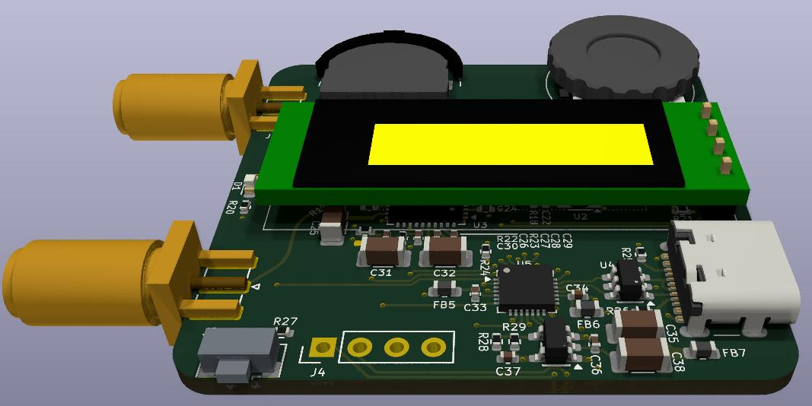

# clock_box
KiCad PCB design for the clock_box: A low cost, versatile signal generator for usage in the digital electronics lab.

See also [clock_box description](https://betz-engineering.ch/open_hardware/clock_box/).

[Schematic](pdf/clock_box.pdf)
